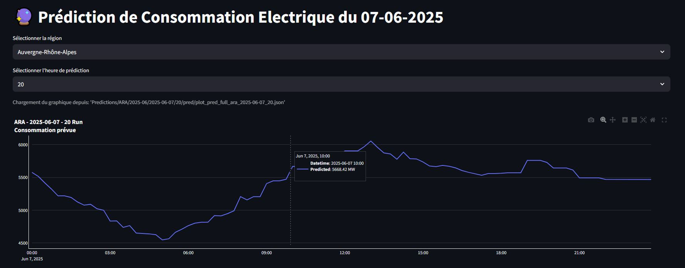
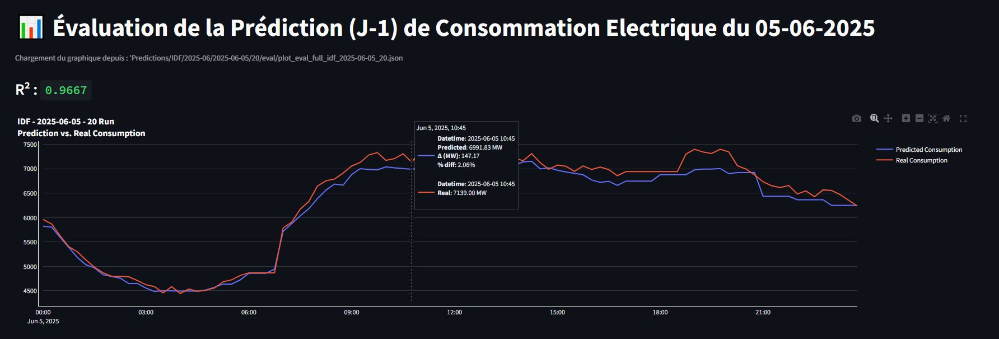
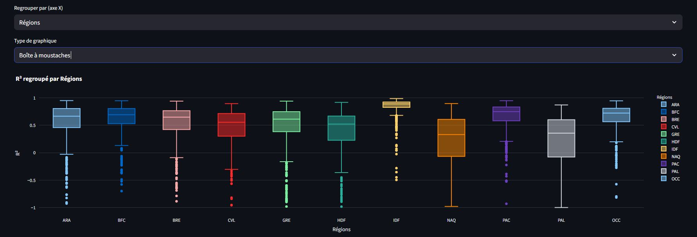

# ⚡ Predi Conso Elec Region

[🇬🇧 Read in English](README.md)

**Une application web de prévision de la consommation électrique régionale en France**

Auteur : [henrisandifer](https://github.com/henrisandifer)

Site web de l'application : https://predi-elec.onrender.com/

---

## 🔍 Présentation

**Predi Conso Elec Region** est un projet complet de data science conçu pour prévoir la consommation électrique quotidienne (D+1) dans toutes les régions de France. Il propose :

- <span style="font-size: 20px;">**Prévisions journalières** à l’aide de plusieurs modèles de machine learning.</span>  
&nbsp;  


- <span style="font-size: 20px;">**Archives historiques** des consommations réelles et des prévisions.</span>  
&nbsp;  


- <span style="font-size: 20px;">**Évaluation automatisée des modèles et visualisations interactives** accessibles via une interface web épurée.</span>  
&nbsp;  


- Une chaîne de traitement entièrement automatisée, déployée et gérée dans le cloud.

Ce projet a été réalisé dans le cadre de ma certification **RNCP Niveau 6 (Développeur Concepteur d'Applications)** et met en avant ma capacité à concevoir, déployer et maintenir une application de data science en conditions réelles.

---

## 🎯 Objectif du Projet

Ce projet reproduit un workflow réel de data science appliqué à la prévision de la demande électrique, un enjeu stratégique pour les gestionnaires de réseau et les fournisseurs d’énergie. Il démontre notamment :

- La capacité à effectuer des prévisions sous contraintes de temps réel
- L’automatisation de la collecte et du traitement de données via des APIs publiques
- L’évaluation et la visualisation des performances de manière scalable

---

## 💼 Points Clés & Compétences Démontrées

Ce projet illustre ma capacité à concevoir et industrialiser des systèmes de machine learning en production avec des outils modernes.

### 🔧 Fonctionnalités principales
- ⚡ **Prévision D+1** de la consommation électrique régionale
- 📈 **Plusieurs modèles XGBoost**, adaptés aux différentes fenêtres de disponibilité des données
- 🔄 **Ingestion quotidienne** des données météo et de consommation via des APIs publiques
- 📊 **Évaluation automatisée** de la performance des modèles
- 📁 **Archivage historique** des prévisions et évaluations (année 2025)
- 📉 **Tableau de bord interactif Streamlit** avec visualisations en temps réel

### 🛠 Stack technique & architecture
- **Python**, **XGBoost**, **Scikit-learn**, **MLFlow** (modélisation & versionnage)
- **Docker**, **AWS ECS**, **S3**, **EventBridge** (déploiement & automatisation)
- **Pathlib**, structure de jobs modulaires, gestion dynamique des fichiers
- **Plotly** pour la visualisation interactive
- Architecture **containerisée et orientée cloud**

### 🚀 Envergure & Réalisation
- Réalisé **en autonomie complète**, dans le cadre de la certification RNCP
- Couvre l’ensemble du cycle de vie data science : **feature engineering → déploiement DevOps**
- Combine **machine learning, ingénierie des données, scripting backend**, et **design frontend**

---

## 📐 Architecture

```bash
root/
├── src/
│   ├── new_data_acquisition/       # 4 jobs modulaires
│   ├── prediction/
│   ├── evaluation/
│   ├── plotting/


    src/
    └── [job_name]/                # Chaque job suit la même structure
        ├── ECS_version/
        ├── local_execution_and_other/
        ├── Dockerfile
        ├── requirements.txt


├── streamlit_src/              # App Streamlit
└── README.md
```

## 🧪 Conception des Modèles

- **5 modèles de régression XGBoost** par région, entraînés et versionnés avec **MLflow**. Des combinaisons de modèles sont utilisées selon le créneau horaire (00h, 02h, 08h, 14h).
- Chaque modèle est optimisé pour une **fenêtre spécifique de disponibilité des données** et pour la **précision**.
- Les variables utilisées incluent : drapeaux calendaires (jours fériés, weekends), données météo (4 colonnes de prévision), composantes saisonnières de Fourier, variables de type "lag" et moyennes glissantes, ainsi que des **interactions polynomiales**.
- La sélection de variables s’est appuyée sur des métriques de performance sur jeux de validation.
- Le réglage des hyperparamètres a été effectué via `GridSearchCV`.
- Les prévisions journalières sont enregistrées sur **AWS S3**, et évaluées le jour suivant via comparaison avec des données réelles.

---

## 🚀 Installation & Utilisation

Pour exécuter ou tester le projet localement :

1. Cloner le repo :
   ```bash
   git clone https://github.com/henrisandifer/predi-conso-elec-region.git
   cd predi-conso-elec-region
   ```

2. Naviguer vers le dossier du job souhaité (par exemple `src/prediction`) et installer les dépendances :
   ```bash
   pip install -r requirements.txt
   ```

3. Configurer vos identifiants AWS (nécessaires pour exécuter les workflows complets en cloud).

4. Suivre les instructions ci-dessous pour exécuter localement un job spécifique.

> ⚠️ La plupart des fonctionnalités sont conçues pour une exécution automatisée via Docker + AWS ECS. L’exécution locale sert principalement à des fins de test ou de démonstration.

---

## 🗂️ Scripts Locaux vs Scripts Cloud

Chaque job contient :

- `ECS_version/` : pour les versions Dockerisées destinées au cloud (AWS ECS, S3)
- `local_execution_and_other/` : pour une exécution locale. Ce dossier contient :
  - `local_run_*.py` : scripts principaux de test local (lecture/écriture locale)
  - `other_scripts/` : scripts utilitaires pour le nettoyage, la vérification ou la transformation des données

Les chemins de fichiers sont gérés dynamiquement via `pathlib`, ce qui permet une exécution locale sans modification de code si la structure du projet est respectée.

---

## 🧪 Exemples d’Exécution Locale

### New Data Acquisition job
```bash
cd src/new_data_acquisition/local_execution_and_other
python local_run_update_cons_data.py
```
```bash
cd src/new_data_acquisition/local_execution_and_other
python local_run_update_temperature_forecast.py --run_time "02"
```

### Prediction job
```bash
cd src/prediction/local_execution_and_other
python local_run_all_models_for_time.py --region "Occitanie" --day "2025-04-01" --time "08:00:00"
```

### Evaluation job
```bash
cd src/evaluation/local_execution_and_other
python run_full_day_eval.py --region "Occitanie" --day "2025-04-01"
```

### Plotting job
```bash
cd src/plotting/local_execution_and_other
python run_plot_pred.py --region "Occitanie" --day "2025-04-01" --time "02:00:00"
```
```bash
cd src/plotting/local_execution_and_other
python run_plot_eval.py --region "Occitanie" --day "2025-04-01"
```

---

## 📊 Tableau de Bord Streamlit

Le tableau de bord interactif permet :

- De visualiser les prévisions D+1 par région pour la journée en cours
- D’accéder aux évaluations journalières pour toutes les régions (2025)
- D’explorer des graphes d’analyse par modèle et par région

> *La Normandie n’est pas incluse en raison d’un manque de données*

---

## 🙋 À propos de moi

Je m’appelle Henri Sandifer, ancien biologiste spécialisé en **microbiologie des sols et champignons mycorhiziens**, aujourd’hui reconverti dans la **data science et le développement logicielle**. J’ai également travaillé dans le secteur **des énergies renouvelables** et je suis passionné par la création d’applications intégrant **modélisation prédictive, automatisation**, et **déploiement cloud**.

Langues parlées : **anglais, français, italien (courant)** ; **japonais, espagnol, arabe, allemand (intermédiaire)**.

---

## 📝 Licence

Ce projet est sous licence MIT – voir le fichier `LICENSE.md` pour plus d’informations.
